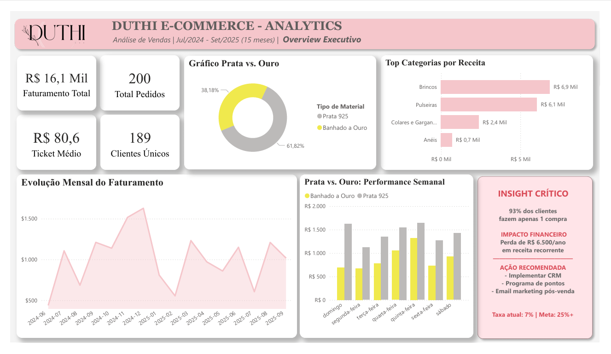

#  Dashboard de Análise de E-commerce Duthi – Power BI

##  Visão Geral do Projeto

Este projeto apresenta uma solução de dados **End-to-End** (Engenharia e Analytics) desenvolvida para a **Duthi** (marca de semijoias).
O objetivo é permitir que os stakeholders monitorem as principais métricas de vendas, o desempenho do mix de produtos (Prata vs. Ouro) e, crucialmente, identifiquem gargalos de **retenção de clientes** (Churn) ao longo de 15 meses.

---

##  Visualização do Dashboard

---

##  Objetivos de Negócio

* Rastrear faturamento, volume de pedidos e tendências de ticket médio.
* Analisar a performance de produtos por categoria e material (Prata vs. Ouro).
* **Diagnóstico de Retenção:** Identificar taxas de recompra e churn.
* **Sazonalidade:** Mapear melhores dias da semana para campanhas.
* Suportar decisões de reposição de estoque baseadas em dados reais.

---

##  Engenharia de Dados (ETL e Pipeline)

A confiabilidade dos dados foi garantida através de um pipeline robusto antes da visualização:

1.  **Pipeline ETL com Python:** Script (`etl_completo.py`) utilizando `Pandas` para limpeza, tipagem e tratamento de nulos.
2.  **Segurança (LGPD):** Aplicação de *hashing* (SHA-256) para anonimizar dados sensíveis (CPF, E-mail) antes da persistência.
3.  **Modelagem Dimensional:** Estruturação de *Star Schema* no PostgreSQL com tabelas Fato e Dimensão bem definidas.
4.  **Otimização de Banco:** Criação de Índices (`CREATE INDEX`) e *Constraints* para garantir integridade referencial e performance de consulta.

---

##  SQL Analytics e Exploração (EDA)

A inteligência do projeto não está limitada ao Power BI. Uma camada profunda de análise exploratória e validação de regras de negócio foi realizada via SQL.

**Destaques Técnicos dos Scripts SQL:**
* **Análise de Cohort & Retenção:** Uso de CTEs para mapear o comportamento de recompra.
* **Window Functions:** Aplicação de `RANK()`, `LAG()` e `AVG() OVER` para cálculos de crescimento (MoM) e médias móveis.
* **Feature Engineering:** Categorização de frete e segmentação de clientes via SQL.

📄 **[Ver Script de Estrutura e Views (DDL)](01_schema_and_views.sql)** – *Modelagem e Otimização.*
📄 **[Ver Script de Análise de Negócio (EDA)](02_analytical_queries.sql)** – *Insights Avançados.*

---

##  Principais KPIs

* **Faturamento Total:** R$ 16,1 Mil
* **Total de Pedidos:** 200
* **Ticket Médio:** R$ 80,6
* **Clientes Únicos:** 189
* **Taxa de Retenção:** ~7% (Alerta crítico de negócio identificado via SQL/DAX)

---

##  Funcionalidades do Dashboard

* **Visão Executiva (One-Page):** KPI cards e gráficos de tendência consolidados.
* **Classificação Dinâmica:** Lógica DAX para segmentação automática "Prata 925" vs "Banhado a Ouro".
* **Alertas de Negócio:** Visualização de impacto financeiro do Churn.
* **Análise de Cross-Selling:** Identificação de tamanho de cesta ideal.

---

##  Ferramentas e Tecnologias

* **SQL (PostgreSQL):** DDL, DML, Window Functions, CTEs e Views.
* **Python (Pandas & Hashlib):** ETL e Anonimização.
* **Power BI (Desktop):** DAX Avançado (`SWITCH`, `CALCULATE`) e UI/UX.
* **Git/GitHub:** Versionamento e Documentação.

---

##  Principais Insights

* **Problema Crítico de Retenção:** 93% dos clientes não retornam, gerando perda estimada de ~R$ 6.5k/ano.
* **Mix de Produtos:** A prata (62%) domina a preferência sobre o ouro, guiando reposição de estoque.
* **Top Categoria:** "Brincos" representam 42% da receita total.
* **Sazonalidade:** Quinta e Sexta-feira concentram os maiores tickets médios.

---

##  Arquivos do Projeto

* `Duthi_Ecommerce_Analytics.pbix` – Arquivo do dashboard interativo.
* `01_schema_and_views.sql` – Criação do Banco, Tabelas e Views.
* `02_analytical_queries.sql` – Queries de análise exploratória e validação.
* `etl_completo.py` – Script Python de tratamento de dados.

---

##  Como Usar

1.  Baixe o arquivo `.pbix` deste repositório.
2.  Abra no **Power BI Desktop**.
3.  Para reproduzir o banco de dados, execute os scripts `.sql` em um ambiente PostgreSQL.

---

##  Feedback e Contato

* **LinkedIn:** [Acessar meu Perfil](https://www.linkedin.com/in/thiago-costa-dados/)

---

##  Tags

Power BI | Data Engineering | ETL | Python | SQL | Dashboard Design | DAX | Business Intelligence
